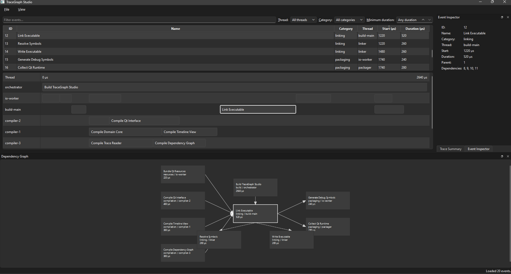
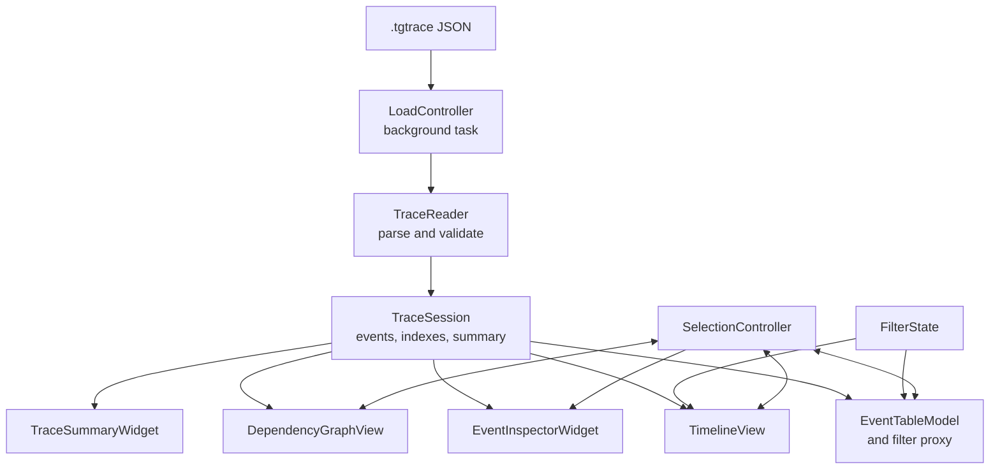

# TraceGraph Studio

TraceGraph Studio is an offline desktop trace-analysis application built with C++20 and Qt 6.11. It loads validated `.tgtrace` JSON files and presents execution events through a sortable table, interactive timeline, dependency graph, event inspector, structured filters, and trace summary.



## Highlights

- Loads local `.tgtrace` files in the background so parsing does not block the interface.
- Strictly validates the application's version 1 schema, including fields, IDs, references, and parent/dependency cycles.
- Reports validation failures with the relevant JSON location and an explanatory message.
- Displays events in a sortable table and a per-thread timeline.
- Filters the table and timeline together by case-insensitive text across all displayed fields, thread, category, and minimum duration.
- Synchronizes selection across the table, timeline, dependency graph, and event inspector.
- Shows the selected event's immediate dependencies, dependents, parent, and children.
- Summarizes total events, threads, categories, and the full trace time span.
- Shows or hides docks from the View menu and preserves the window geometry, dock arrangement, and table/timeline splitter position.
- Reduces rendering work for dense traces by caching timeline metadata, skipping off-screen events, and bucketing overlapping bars.

## Getting started

### Requirements

- CMake 3.22 or newer
- Qt 6.11 or newer with the Widgets and Concurrent modules
- A C++20 compiler compatible with the selected Qt kit
- Ninja if you use the commands below

The current verified development environment is Windows with Qt 6.11.1, Qt's 64-bit MinGW 13.1 kit, and Ninja. Other platforms have not yet been verified.

### Configure and build on Windows

Open PowerShell in the repository root. Update these example paths to match your Qt installation:

```powershell
$qtKit = "C:\Qt\6.11.1\mingw_64"
$mingwBin = "C:\Qt\Tools\mingw1310_64\bin"
$ninjaBin = "C:\Qt\Tools\Ninja"
$cmakeBin = "C:\Qt\Tools\CMake_64\bin"

$env:Path = "$qtKit\bin;$mingwBin;$ninjaBin;$cmakeBin;$env:Path"

cmake -S . -B build -G Ninja `
    -DCMAKE_BUILD_TYPE=Release `
    -DCMAKE_PREFIX_PATH="$qtKit"

cmake --build build
```

Keep the compiler and runtime on `PATH` from the same Qt kit. Mixing a different MinGW installation with the Qt-provided MinGW libraries can produce configuration or linking failures. Use a new build directory when changing generators or compiler toolchains.

The executable is written to:

```text
build/bin/tracegraph-studio.exe
```

Run it from the same PowerShell session:

```powershell
.\build\bin\tracegraph-studio.exe
```

### Deploy the Windows runtime

To make the build directory runnable without the development `PATH`, deploy the required Qt plugins, libraries, and compiler runtime:

```powershell
& "$qtKit\bin\windeployqt.exe" `
    --release `
    --compiler-runtime `
    --force `
    --qtpaths "$qtKit\bin\qtpaths.exe" `
    ".\build\bin\tracegraph-studio.exe"
```

The checked-in `.vscode` files reflect one Windows workstation. Update their Qt tool paths before using the included build and launch tasks, and keep the CMake build type consistent with the `windeployqt` mode.

## Usage

1. Launch TraceGraph Studio.
2. Choose **File > Open** and select a `.tgtrace` file.
3. Click an event in the table, timeline, or dependency graph to synchronize the other views.
4. Use the controls above the table to filter by text, thread, category, or minimum duration.

Timeline controls:

- Click an event bar to select it.
- Use the scroll bars to navigate the lanes and time range.
- Hold `Ctrl` and use the mouse wheel to zoom around the cursor position.

Dependency graph controls:

- Click a node to select its event.
- Drag the graph background to pan.
- Hold `Ctrl` and use the mouse wheel to zoom.
- Solid arrows show dependency direction; dashed arrows show parent/child hierarchy.

## Showcase trace

The primary demonstration file is [`samples/showcase-build.tgtrace`](samples/showcase-build.tgtrace). It models a build of TraceGraph Studio with parallel compilation, linking, packaging, testing, and publishing work.

| Metric | Value |
| --- | ---: |
| Events | 20 |
| Threads | 8 |
| Categories | 11 |
| Trace span | 2,640 µs |

Select **Link Executable** to display a useful graph containing four dependencies, two dependents, one parent, and two children.

## `.tgtrace` format

Version 1 traces are strict JSON objects. The root contains exactly three fields:

- `schemaVersion`: the integer `1`
- `timeUnit`: the string `"microseconds"`
- `events`: an array of event objects

Example:

```json
{
  "schemaVersion": 1,
  "timeUnit": "microseconds",
  "events": [
    {
      "id": 1,
      "name": "Load Trace",
      "category": "loading",
      "thread": "main",
      "start": 0,
      "duration": 500
    },
    {
      "id": 2,
      "name": "Read File",
      "category": "io",
      "thread": "worker-1",
      "start": 10,
      "duration": 90,
      "parentId": 1
    },
    {
      "id": 3,
      "name": "Parse JSON",
      "category": "parsing",
      "thread": "worker-1",
      "start": 100,
      "duration": 250,
      "parentId": 1,
      "dependsOn": [2]
    }
  ]
}
```

### Event fields

| Field | Required | Type | Rules |
| --- | :---: | --- | --- |
| `id` | Yes | Integer | Positive and unique within the trace |
| `name` | Yes | String | Must not be empty |
| `category` | Yes | String | Must not be empty |
| `thread` | Yes | String | Must not be empty |
| `start` | Yes | Integer | Microseconds; must be zero or greater |
| `duration` | Yes | Integer | Microseconds; must be positive |
| `parentId` | No | Integer | Must reference another existing event |
| `dependsOn` | No | Array of integers | Each ID must be unique and reference another existing event |

The loader rejects:

- malformed JSON and unknown root or event fields;
- duplicate event IDs or duplicate IDs within one `dependsOn` array;
- missing references and self references;
- cycles in either parent relationships or dependency relationships.

Events do not need to appear in timestamp or dependency order. Version 1 validates graph structure but does not enforce parent time containment or dependency timing.

## Architecture



The source tree is divided into three layers:

- `src/domain`: trace events, immutable session data, relationship indexes, load results, and cached summary values.
- `src/io`: file reading, strict JSON parsing, schema validation, and graph validation.
- `src/app`: Qt models, controllers, widgets, custom views, filtering, selection, and window coordination.

CMake builds the application code as the static `tracegraph_app` library and links it into the `tracegraph-studio` executable.

## Repository layout

```text
TraceGraph Studio/
|-- CMakeLists.txt
|-- samples/
|   |-- showcase-build.tgtrace
|   |-- valid-basic.tgtrace
|   |-- valid-many-threads.tgtrace
|   `-- invalid-missing-reference.tgtrace
`-- src/
    |-- app/
    |-- domain/
    |-- io/
    |-- CMakeLists.txt
    `-- main.cpp
```

## Included samples

| File | Purpose |
| --- | --- |
| [`showcase-build.tgtrace`](samples/showcase-build.tgtrace) | Full README demonstration with hierarchy, dependencies, and parallel work |
| [`valid-basic.tgtrace`](samples/valid-basic.tgtrace) | Minimal valid trace with three related events |
| [`valid-many-threads.tgtrace`](samples/valid-many-threads.tgtrace) | Eight events distributed across eight timeline lanes |
| [`invalid-missing-reference.tgtrace`](samples/invalid-missing-reference.tgtrace) | Intentionally invalid trace for demonstrating reference validation |

## Current scope

TraceGraph Studio is currently version 0.1.0. It analyzes local `.tgtrace` files; it does not yet capture live traces, edit events, export results, or import third-party trace formats. The dependency graph displays the selected event's immediate neighborhood rather than the complete transitive graph.
